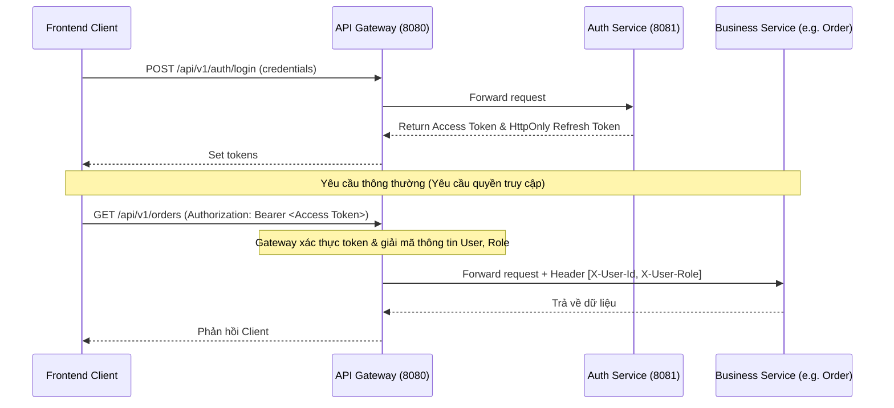

# Kiến trúc hệ thống MedCare

Hệ thống MedCare tuân theo mô hình **Microservices Kiến trúc phân tán** kết hợp đa ngôn ngữ (Spring Boot cho nghiệp vụ thương mại điện tử dược phẩm, FastAPI cho trí tuệ nhân tạo y tế). Toàn bộ hệ thống giao tiếp thông qua API Gateway trung tâm.

---

## 1. Bản đồ Microservices & Cổng kết nối (Port Mapping)

| Tên Service | Nền tảng | Cổng (Port) | Vai trò chuyên môn |
| :--- | :--- | :--- | :--- |
| **discovery-server** | Java / Eureka | `8761` | Trung tâm đăng ký & định danh dịch vụ (Service Registry). |
| **api-gateway** | Java / Gateway | `8080` | Điểm truy cập duy nhất (Entry point), chịu trách nhiệm định tuyến & xác thực JWT. |
| **auth-service** | Java / Security | `8081` | Đăng ký, đăng nhập, cấp phát JWT, xoay vòng Refresh Token, OTP. |
| **user-service** | Java / JPA | `8082` | Quản lý thông tin cá nhân, sổ địa chỉ nhận hàng, hồ sơ bệnh án và đơn thuốc tải lên. |
| **product-service** | Java / JPA | `8083` | Quản lý danh mục thuốc, thuộc tính y tế, bảng giá và hệ thống triệu chứng lâm sàng. |
| **order-service** | Java / JPA | `8084` | Quản lý giỏ hàng, đặt hàng, tính toán đơn hàng (OTC & kê đơn). |
| **inventory-service** | Java / JPA | `8085` | Quản lý kho, lô hàng, hạn sử dụng thuốc và phân bổ hàng theo nguyên tắc FEFO. |
| **payment-service** | Java / JPA | `8086` | Xử lý thanh toán COD và tạo/xử lý giao dịch VNPay. |
| **shipping-service** | Java / JPA | `8087` | Tích hợp Giao Hàng Nhanh (GHN) để tính toán cước phí và quản lý vận đơn. |
| **promotion-service** | Java / JPA | `8088` | Quản lý các chiến dịch khuyến mại, mã giảm giá (voucher) và áp dụng voucher cho đơn hàng. |
| **review-service** | Java / JPA | `8089` | Quản lý đánh giá sản phẩm từ thành viên hoặc khách vãng lai, duyệt bình luận. |
| **ai-service** | Python / FastAPI | `8000` | Xử lý Chatbot AI, phân tích đơn thuốc OCR (Gemini), khuyến nghị sản phẩm thông minh. |

---

## 2. Cơ chế Bảo mật & Phân quyền (Authentication & Authorization)

Hệ thống triển khai cơ chế **Stateless Authentication** dựa trên **JSON Web Token (JWT)**:

### Chi tiết phân quyền trên API Gateway
API Gateway chặn tất cả các request đi qua cổng `8080`. 
*   **Public Endpoints:** `/api/v1/auth/**`, `/api/v1/products/**` (chỉ xem), `/api/v1/categories/**` được cấu hình bypass filter.
*   **Protected Endpoints:** Yêu cầu Header `Authorization: Bearer <Token>`. Gateway sử dụng JWT Decoder để giải mã và gắn thông tin định danh `X-User-Id` và `X-User-Role` vào request headers trước khi chuyển tiếp đến các service nội bộ.
*   **Role-Based Access Control (RBAC):**
    *   `ADMIN`: Có quyền truy cập các đường dẫn `/api/v1/admin/**` ở tất cả các service.
    *   `PHARMACIST`: Có quyền truy cập các endpoint duyệt đơn thuốc, xem thông tin tồn kho lô hàng.
    *   `USER` / `MEMBER`: Truy cập các thông tin cá nhân, đặt hàng, gửi yêu cầu tư vấn.

---

## 3. Giao tiếp giữa các Dịch vụ (Inter-service Communication)

### Giao tiếp Đồng bộ (Synchronous)
*   **OpenFeign (Java):** Các microservice Java trao đổi thông tin trực tiếp với nhau thông qua interface khai báo Feign Client. Ví dụ, `order-service` gọi `inventory-service` để giữ chỗ sản phẩm (reserve inventory) khi khách hàng tiến hành thanh toán.
*   **HTTPX (FastAPI):** Dịch vụ AI gọi các API của `product-service` để kiểm tra thông tin thuốc thực tế nhằm đưa ra các đề xuất sản phẩm chính xác trong chatbot.

### Đăng ký dịch vụ tự động (Eureka Service Discovery)
Tất cả các dịch vụ (kể cả dịch vụ Python `ai-service`) đăng ký thông tin IP/Port của mình lên `discovery-server` khi khởi động. Các dịch vụ gọi nhau thông qua tên ứng dụng (Service ID) thay vì IP tĩnh (ví dụ: `http://product-service/api/v1/...`).

---

## 4. Kiến trúc Frontend (Next.js 15 App Router)

Frontend của MedCare được thiết kế theo cấu trúc mô-đun hóa cao, tách biệt phần giao diện hiển thị và phần xử lý logic nghiệp vụ/gọi API.

### Cấu trúc luồng dữ liệu Client
1.  **Layouts:**
    *   `RootLayout` (`FE/app/layout.tsx`): Chứa thanh Header, Footer toàn trang, cấu hình NextAuth Provider, React Query Client Provider và các component nổi như giỏ hàng (`CartDrawer`), `AIChatbot` trôi nổi.
    *   `AdminLayout` (`FE/app/admin/layout.tsx`): Bố cục trang quản trị chuyên dụng với sidebar điều hướng, header hiển thị thông tin admin, bảo vệ nghiêm ngặt bằng phân quyền NextAuth.
2.  **API Client Layer (`FE/services/`):**
    Mỗi microservice có một file client API tương ứng (ví dụ: `productService.ts`, `orderService.ts`) sử dụng Axios để gọi các endpoints qua Gateway (`/api/v1/...`). Nó tự động đính kèm Token JWT lấy từ Session của NextAuth vào header.
3.  **Quản lý State:**
    *   **Zustand (Global Client State):** Sử dụng cho giỏ hàng (`useCartStore`) để xử lý thêm/sửa/xóa nhanh chóng, giữ trạng thái giỏ hàng tạm thời và đồng bộ với LocalStorage đối với khách vãng lai, đồng bộ lên Database khi đăng nhập.
    *   **React Query (Server State):** Quản lý trạng thái fetching danh mục, danh sách thuốc, và danh sách đánh giá của sản phẩm để tránh gọi API trùng lặp và tăng tốc hiển thị nhờ caching.
4.  **Chế độ Responsive:**
    Giao diện Next.js được thiết kế tương thích 100% với Mobile và Desktop bằng Grid/Flexbox của Tailwind CSS:
    *   **Chatbot Tư vấn (`/tu-van`):** Thiết kế hai cột trên máy tính (Split-Pane: 8 phần Chat - 4 phần Sidebar gợi ý sản phẩm). Trên thiết bị di động, phần Sidebar gợi ý sản phẩm sẽ tự động ẩn đi, các sản phẩm được tích hợp trực tiếp thành slide trượt (Carousel) bên trong tin nhắn chat để tối ưu diện tích hiển thị.
